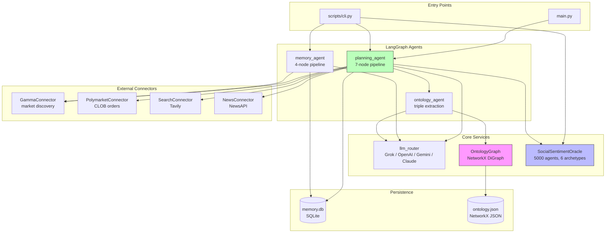

# onto-market Repository Map

_Auto-generated by `scripts/generate_repo_map.py` on 2026-03-28 10:56 UTC._
_Regenerate: `make repo-map`_

---

## Project State

| Dimension | Value |
|-----------|-------|
| Maturity | Advanced prototype / mature MVP — v0.1.0 |
| Pipeline | `planning_agent`: research → ontology → stats → probability → swarm → decision → trade |
| Differentiator | Ontology accumulation + heterogeneous swarm simulation |
| Top debt | Packaging drift (root + src/ mix), ontology not thread-safe |
| Phase 2 stubs | Zep Cloud, domain registry, Vue dashboard |

---

## Architecture Diagram



---

## Annotated File Tree

```
onto-market/
├── .claude
│   ├── worktrees
│   │   └── charming-fermat
│   │       └── .claude
│   │           └── settings.local.json
│   └── settings.local.json
├── .cursor
│   ├── rules
│   │   └── onto-market.mdc
│   └── rules.md
├── .grok
│   └── settings.json
├── .vscode
│   └── settings.json
├── agents
│   ├── __init__.py
│   ├── memory_agent.py   # ✅ DB-first pipeline (memory→enrichment→reasoning→decide)
│   ├── ontology_agent.py   # ✅ Extracts semantic triples → OntologyGraph
│   ├── planning_agent.py   # ✅ Full 7-node pipeline (research→ontology→stats→probability→swarm→decision→trade)
│   └── state.py   # ✅ AgentState / MemoryAgentState / PlanningState TypedDicts
├── config
│   ├── .env
│   ├── __init__.py
│   └── config.py   # ✅ Env vars, decision thresholds, swarm params
├── core
│   ├── __init__.py
│   ├── agent_base.py   # ⚠ Vestigial — BaseAgent defined but unused
│   ├── graph.py   # ✅ register_graph() decorator
│   ├── llm_router.py   # ✅ LiteLLM multi-provider (Grok / GPT / Gemini / Claude)
│   └── state.py   # ⚠ Vestigial — duplicates agents/state.py
├── data
│   ├── memory.db   # ✅ Live SQLite — markets + analytics
│   └── ontology.json   # ✅ Live ontology graph — grows each planning_agent run
├── ontology
│   ├── __init__.py
│   └── graph.py   # ✅ OntologyGraph (NetworkX DiGraph, JSON-persisted) ⚠ NOT thread-safe
├── scripts
│   ├── audit_ontology.py   # ✅ Ontology health check (PageRank + confidence dist)
│   ├── cli.py   # ✅ Typer CLI entry point
│   ├── generate_repo_map.py   # ✅ This script — auto-generates REPO_MAP.md
│   └── refresh_markets.py   # ✅ Seed data/memory.db from Gamma API
├── src
│   ├── connectors
│   │   ├── __init__.py
│   │   ├── gamma.py   # ✅ Gamma Markets API — paginated, search
│   │   ├── news.py   # ✅ NewsAPI headlines
│   │   ├── polymarket.py   # ✅ Polymarket CLOB order builder
│   │   └── search.py   # ✅ Tavily web search
│   ├── memory
│   │   ├── __init__.py
│   │   ├── manager.py   # ✅ SQLite MemoryManager (upsert, search, analytics)
│   │   └── zep_reader.py   # ⏳ Phase 2 stub — Zep Cloud, not wired
│   ├── polymarket_agents
│   │   ├── utils
│   │   │   ├── __init__.py
│   │   │   ├── analytics.py   # ✅ score_market, kelly_fraction, calculate_edge, EV
│   │   │   ├── database.py   # ✅ Database SQLite wrapper
│   │   │   └── objects.py   # ✅ Market, ResearchNote dataclasses
│   │   └── __init__.py
│   ├── swarm
│   │   ├── __init__.py
│   │   ├── archetypes.py   # ✅ 6 archetypes: BULL / BEAR / ANALYST / CONTRARIAN / NOISE_TRADER / INSIDER
│   │   ├── dynamics.py   # ✅ build_network() + run_dynamics() (Watts-Strogatz)
│   │   └── oracle.py   # ✅ SocialSentimentOracle — 5000 agents, small-world net
│   ├── trading
│   │   ├── __init__.py
│   │   ├── executor.py   # ✅ SAFE_MODE executor (dry-run default)
│   │   └── trader.py   # ✅ discover→filter→map→superforecast→execute pipeline
│   ├── utils
│   │   ├── __init__.py
│   │   ├── file_parser.py
│   │   ├── llm_client.py   # ✅ LLMClient wrapping the router
│   │   ├── logger.py   # ✅ get_logger() — structured + rotating file
│   │   └── retry.py   # ✅ retry_with_backoff (tenacity)
│   └── context.py
├── tests
│   ├── __init__.py
│   ├── conftest.py   # ✅ sample_market, db_path fixtures
│   ├── test_analytics.py   # ✅ Edge / Kelly / EV unit tests
│   ├── test_integration.py   # ✅ End-to-end smoke tests
│   ├── test_memory.py   # ✅ MemoryManager unit tests
│   ├── test_planning_agent.py   # ✅ Planning agent integration tests
│   ├── test_swarm.py   # ✅ SocialSentimentOracle tests
│   └── test_trading.py   # ✅ Trading executor tests
├── .env
├── .gitattributes
├── AGENTS.md
├── CLAUDE.md
├── CURSOR.md
├── GEMINI.md
├── langgraph.json   # ✅ LangGraph graph registry
├── main.py   # ✅ CLI entry point
├── Makefile   # ✅ make test | dryrun | repo-map | ontology-audit
├── package.json
├── pyproject.toml   # ⚠ Packaging drift — dual layout (root + src/); unify into src/
├── pyrightconfig.json
├── README.md
├── REPO_MAP.md
└── requirements.txt
```

---

## Logical Layers

### Layer 1: Entry Points

| Module | Description |
|--------|-------------|
| `main.py` | CLI entry point — parses query, invokes planning_agent |
| `scripts/cli.py` | Typer CLI — analyze, scan, trade, swarm commands |
| `scripts/refresh_markets.py` | Seed markets.db from Gamma API |

### Layer 2: Agent Orchestration

| Module | Description |
|--------|-------------|
| `agents/planning_agent.py` | Full 7-node LangGraph pipeline |
| `agents/memory_agent.py` | DB-first 4-node pipeline |
| `agents/ontology_agent.py` | Triple extraction + graph query |
| `agents/state.py` | TypedDict state definitions |

### Layer 3: Domain Logic

| Module | Description |
|--------|-------------|
| `ontology/graph.py` | OntologyGraph — knowledge accumulation engine |
| `src/swarm/oracle.py` | SocialSentimentOracle — swarm consensus |
| `src/swarm/archetypes.py` | 6 agent archetypes with configurable biases |
| `src/swarm/dynamics.py` | Watts-Strogatz network + influence propagation |
| `src/polymarket_agents/utils/analytics.py` | Edge, Kelly, EV calculations |
| `src/trading/executor.py` | Trade sizing and execution |
| `src/trading/trader.py` | Trading pipeline orchestration |

### Layer 4: Connectors & I/O

| Module | Description |
|--------|-------------|
| `src/connectors/gamma.py` | Polymarket Gamma API client |
| `src/connectors/polymarket.py` | Polymarket CLOB trading client |
| `src/connectors/search.py` | Tavily web search |
| `src/connectors/news.py` | NewsAPI headlines |
| `src/memory/manager.py` | SQLite memory persistence |

### Layer 5: Utilities & Infrastructure

| Module | Description |
|--------|-------------|
| `core/llm_router.py` | Multi-LLM routing via LiteLLM |
| `config/config.py` | Configuration management |
| `src/context.py` | AppContext dependency injection |
| `src/utils/llm_client.py` | LLMClient wrapper |
| `src/utils/retry.py` | Retry logic (tenacity) |
| `src/utils/logger.py` | Structured logging |

---

## Module Verdicts

| Module | Status | Verdict |
|--------|--------|---------|
| `Makefile` | Phase 1 | ✅ make test | dryrun | repo-map | ontology-audit |
| `agents/memory_agent.py` | Phase 1 | ✅ DB-first pipeline (memory→enrichment→reasoning→decide) |
| `agents/ontology_agent.py` | Phase 1 | ✅ Extracts semantic triples → OntologyGraph |
| `agents/planning_agent.py` | Phase 1 | ✅ Full 7-node pipeline (research→ontology→stats→probability→swarm→decision→trade) |
| `agents/state.py` | Phase 1 | ✅ AgentState / MemoryAgentState / PlanningState TypedDicts |
| `config/config.py` | Phase 1 | ✅ Env vars, decision thresholds, swarm params |
| `core/graph.py` | Phase 1 | ✅ register_graph() decorator |
| `core/llm_router.py` | Phase 1 | ✅ LiteLLM multi-provider (Grok / GPT / Gemini / Claude) |
| `data/memory.db` | Phase 1 | ✅ Live SQLite — markets + analytics |
| `data/ontology.json` | Phase 1 | ✅ Live ontology graph — grows each planning_agent run |
| `langgraph.json` | Phase 1 | ✅ LangGraph graph registry |
| `main.py` | Phase 1 | ✅ CLI entry point |
| `ontology/graph.py` | Phase 1 | ✅ OntologyGraph (NetworkX DiGraph, JSON-persisted) ⚠ NOT thread-safe |
| `scripts/audit_ontology.py` | Phase 1 | ✅ Ontology health check (PageRank + confidence dist) |
| `scripts/cli.py` | Phase 1 | ✅ Typer CLI entry point |
| `scripts/generate_repo_map.py` | Phase 1 | ✅ This script — auto-generates REPO_MAP.md |
| `scripts/refresh_markets.py` | Phase 1 | ✅ Seed data/memory.db from Gamma API |
| `src/connectors/gamma.py` | Phase 1 | ✅ Gamma Markets API — paginated, search |
| `src/connectors/news.py` | Phase 1 | ✅ NewsAPI headlines |
| `src/connectors/polymarket.py` | Phase 1 | ✅ Polymarket CLOB order builder |
| `src/connectors/search.py` | Phase 1 | ✅ Tavily web search |
| `src/memory/manager.py` | Phase 1 | ✅ SQLite MemoryManager (upsert, search, analytics) |
| `src/polymarket_agents/utils/analytics.py` | Phase 1 | ✅ score_market, kelly_fraction, calculate_edge, EV |
| `src/polymarket_agents/utils/database.py` | Phase 1 | ✅ Database SQLite wrapper |
| `src/polymarket_agents/utils/objects.py` | Phase 1 | ✅ Market, ResearchNote dataclasses |
| `src/swarm/archetypes.py` | Phase 1 | ✅ 6 archetypes: BULL / BEAR / ANALYST / CONTRARIAN / NOISE_TRADER / INSIDER |
| `src/swarm/dynamics.py` | Phase 1 | ✅ build_network() + run_dynamics() (Watts-Strogatz) |
| `src/swarm/oracle.py` | Phase 1 | ✅ SocialSentimentOracle — 5000 agents, small-world net |
| `src/trading/executor.py` | Phase 1 | ✅ SAFE_MODE executor (dry-run default) |
| `src/trading/trader.py` | Phase 1 | ✅ discover→filter→map→superforecast→execute pipeline |
| `src/utils/llm_client.py` | Phase 1 | ✅ LLMClient wrapping the router |
| `src/utils/logger.py` | Phase 1 | ✅ get_logger() — structured + rotating file |
| `src/utils/retry.py` | Phase 1 | ✅ retry_with_backoff (tenacity) |
| `src/memory/zep_reader.py` | Phase 2 | ⏳ Phase 2 stub — Zep Cloud, not wired |
| `core/agent_base.py` | Vestigial | ⚠ Vestigial — BaseAgent defined but unused |
| `core/state.py` | Vestigial | ⚠ Vestigial — duplicates agents/state.py |
| `pyproject.toml` | Vestigial | ⚠ Packaging drift — dual layout (root + src/); unify into src/ |
| `tests/conftest.py` | Tests | ✅ sample_market, db_path fixtures |
| `tests/test_analytics.py` | Tests | ✅ Edge / Kelly / EV unit tests |
| `tests/test_integration.py` | Tests | ✅ End-to-end smoke tests |
| `tests/test_memory.py` | Tests | ✅ MemoryManager unit tests |
| `tests/test_planning_agent.py` | Tests | ✅ Planning agent integration tests |
| `tests/test_swarm.py` | Tests | ✅ SocialSentimentOracle tests |
| `tests/test_trading.py` | Tests | ✅ Trading executor tests |

---

## Live Ontology State

| Metric | Value |
|--------|-------|
| Nodes | 19 |
| Edges | 11 |
| Top entities | bitcoin price, 100,000 milestone, inflation adjustment, nominal high, momentum buying, sec crackdown, price growth, bitcoin |
| Path | `data/ontology.json` |
| Thread-safe | No — add file locking before concurrent agents |

> Grows every `planning_agent` run via `ontology_node` → `ontology/graph.py`.

---

## Live Memory DB

| Metric | Value |
|--------|-------|
| Exists | Yes |
| Size | 132 KB |
| Path | `data/memory.db` |

---

## Top Leverage Points

1. **Unify packaging** — move root packages (`agents/`, `config/`, `core/`, `ontology/`) into `src/`; fix `pyproject.toml`
2. **Thread-safe ontology** — add file locking to `OntologyGraph._save()` and `add_triples()`
3. **Backtest swarm** — run on resolved Polymarket data; compute Brier Score delta (swarm ON vs OFF)
4. **Separate side effects** — move `memory.store_analytics()` from `decision_node` to `trade_node`
5. **PageRank audit** — `make ontology-audit` to surface high-influence entities; prune low-degree noise

---

_Run `make ontology-audit` for PageRank + confidence distribution analysis._
